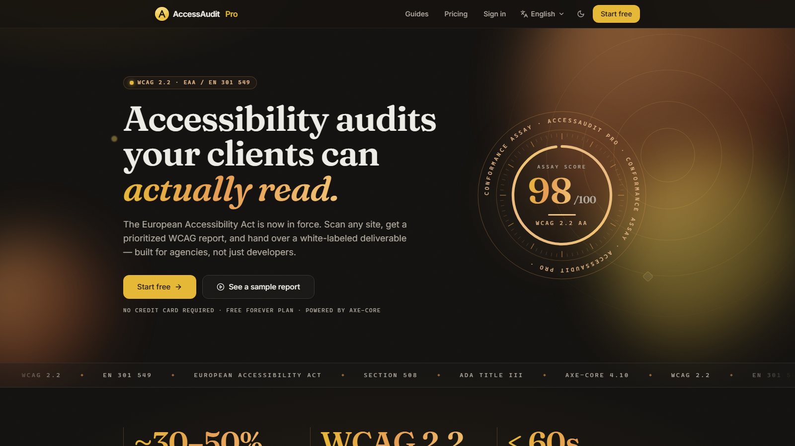
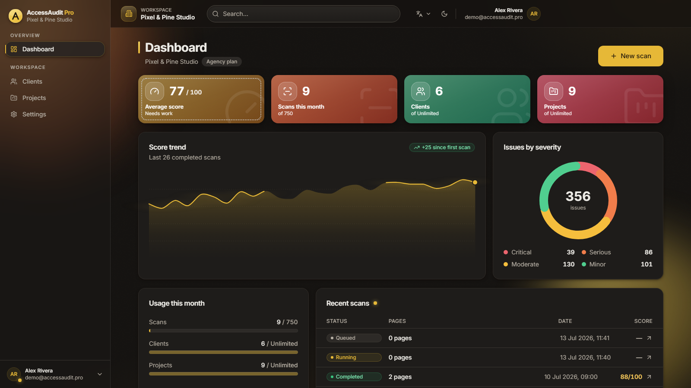
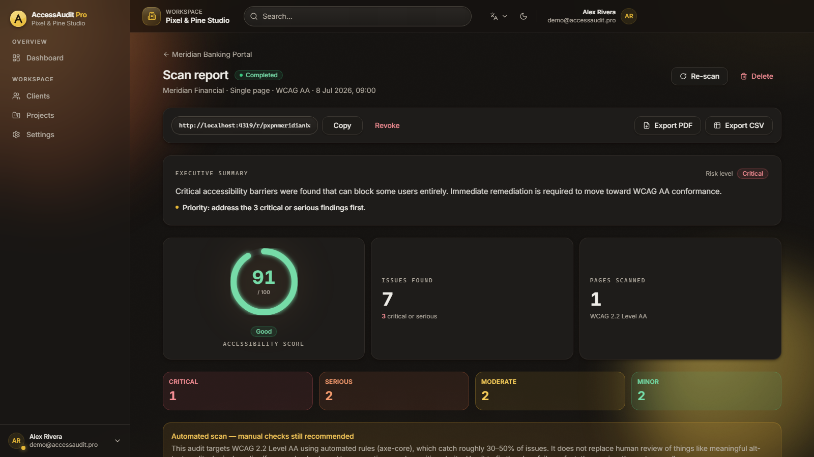
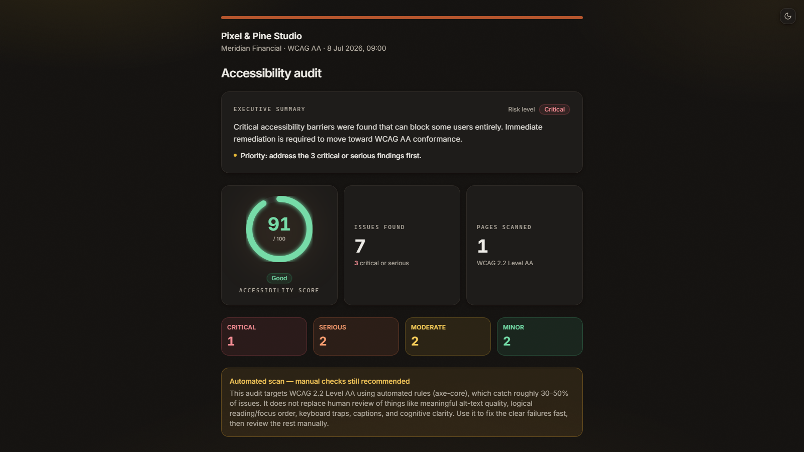
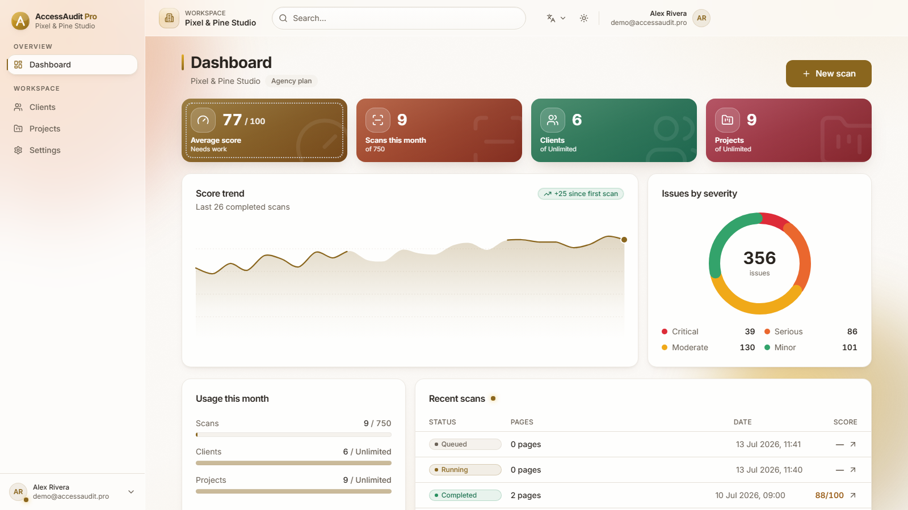

<div align="center">

# AccessAudit Pro

**On-demand WCAG 2.2 accessibility audits & white-label reports for agencies.**

*Point it at any URL. Get a scored, prioritized, client-ready report — built for agencies, not just developers.*

[](https://nextjs.org)
[](https://react.dev)
[](https://www.typescriptlang.org)
[](https://supabase.com)
[](https://stripe.com)
[](tests/)
[](https://www.w3.org/TR/WCAG22/)
[](LICENSE)

**[▶ Live demo — accessaudit-pro.vercel.app](https://accessaudit-pro.vercel.app)** &nbsp;·&nbsp; No signup — runs on a seeded demo agency.



</div>

---

## Why it exists

The **European Accessibility Act** is in force, and WCAG conformance has moved from a nice-to-have to a contractual requirement. Agencies now have to audit their clients' sites — but the existing tooling is built for engineers: walls of console output, no client-facing deliverable, no way to organize work across clients.

AccessAudit Pro closes that gap. An agency points it at a URL, a headless-Chromium worker runs [axe-core](https://github.com/dequelabs/axe-core) against WCAG 2.2 AA, and the result is a **scored, severity-prioritized report a client can actually read** — with plain-language fix guidance, a per-page breakdown, an executive summary with a risk grade, and a one-click white-label share link or PDF.

> Automated rules catch ~30–50% of WCAG issues. The product says so plainly on every report and frames itself as the fast first pass before manual review — not a compliance rubber stamp.

---

## Features

**Auditing**
- Headless-Chromium + axe-core scans against **WCAG 2.2 Level A / AA**
- Single-page or bulk URL-list scans, with a durable scan queue, heartbeat, and retry/attempt tracking
- Real-time scan progress (Supabase Realtime) — watch a scan go from queued → running → completed live
- Deterministic 0–100 scoring, weighted by issue impact, with severity rollups (critical / serious / moderate / minor)

**Reports & deliverables**
- Executive summary with an auto-derived **risk grade** (a single blocker = critical risk, independent of the breadth score)
- Violations grouped per axe rule, mapped to WCAG criteria, with fix guidance and affected-element detail
- Per-page scores and issue counts
- **White-label share links** (`/r/<token>`) with revoke, **PDF export**, and CSV/JSON data export
- SSRF-safe URL validation so scans can't be pointed at internal/metadata endpoints

**Agency workspace**
- Multi-tenant: organizations → clients → projects → scans, isolated by Postgres **Row-Level Security**
- Dashboard with KPI tiles, score-trend chart, severity donut, usage meters, and recent scans
- Stripe billing across four tiers with usage quotas enforced atomically in the database

**Craft**
- **Gilded Charcoal** design identity — Luxury Gold on warm charcoal, dark-first, Fraunces display over Inter — in both a dark stage and a warm-ivory day theme
- Full internationalization: **English, French, Arabic, Spanish, Chinese**, with correct **RTL** mirroring
- Accessibility held to its own standard: keyboard paths, focus states, reduced-motion support, and AA contrast throughout (verified in both themes)

---

## Screenshots

| Dashboard | Scan report |
| --- | --- |
|  |  |

| White-label shared report | Dashboard — day theme |
| --- | --- |
|  |  |

Every route, in light and dark at portfolio aspect ratios, is captured from the live product via [`apps/web/scripts/capture.mjs`](apps/web/scripts/capture.mjs); cinematic device mockups via [`apps/web/scripts/marketing-assets.mjs`](apps/web/scripts/marketing-assets.mjs) (output kept local, outside git).

---

## Architecture

A pnpm + Turborepo monorepo with a clean **web / worker split** and a shared, framework-free domain core. Full write-up in [`ARCHITECTURE.md`](ARCHITECTURE.md).

```
                         ┌──────────────────────────────┐
   Browser  ───────────► │  apps/web  (Next.js 15)       │
                         │  • App Router, RSC, SSR auth  │
                         │  • Server Actions (mutations) │
                         │  • Stripe Checkout/Portal     │
                         │  • Public report  /r/[token]  │
                         └───────┬───────────────▲───────┘
                                 │ insert scan    │ realtime + poll
                                 │ (status=queued)│ (status updates)
                                 ▼                │
                         ┌──────────────────────────────┐
                         │  Supabase Postgres            │
                         │  • RLS on every tenant table  │
                         │  • claim_next_scan() RPC      │
                         │    (FOR UPDATE SKIP LOCKED)   │
                         │  • Auth, Realtime, Storage    │
                         └───────▲───────────────┬───────┘
                       claim job │               │ write pages +
                  (service role) │               │ violations
                         ┌───────┴───────────────▼───────┐
                         │  apps/worker (Node)           │
                         │  • Playwright + axe-core      │
                         │  • SSRF guard, timeouts       │
                         │  • heartbeat + reaper         │
                         └──────────────────────────────┘
```

**Key decisions**
- **Separate always-on worker** — axe-core needs a rendered DOM (headless Chromium), which can't run in serverless/edge functions, so the scan engine is a dedicated Node service. The web app stays fast and serverless-friendly.
- **Postgres-native queue, no Redis** — the web app inserts a `scans` row; the worker claims jobs atomically via a `claim_next_scan()` RPC using `FOR UPDATE SKIP LOCKED`, so replicas never double-process. A per-page heartbeat + reaper recovers crashed scans.
- **One source of truth for domain logic** — plan limits, scoring, and the impact taxonomy live in `packages/shared`, imported by both web and worker, so the report, the worker, and the public sample can never disagree. Unit-tested in isolation.

---

## Tech stack

- **Framework** — Next.js 15 (App Router, Server Actions, typed routes), React 19, TypeScript (strict)
- **Styling** — Tailwind CSS 3 with a bespoke design-token layer; self-hosted Inter + Fraunces via `next/font`
- **Backend** — Supabase (Postgres, Auth, Row-Level Security, Realtime); **13 SQL migrations** covering schema, triggers, RLS, the scan queue, atomic quota/persist RPCs, rate limiting, and Stripe event idempotency
- **Worker** — a standalone Node service (`apps/worker`) running Playwright + `@axe-core/playwright` to render pages and run the audit
- **Billing** — Stripe (Checkout, Billing Portal, webhooks with signature verification + idempotent event storage)
- **Observability** — Sentry (web + worker), gated on a DSN
- **Tooling** — pnpm workspaces + Turborepo, Vitest (**80 unit tests**), Playwright (e2e), ESLint, GitHub Actions CI + CodeQL
- **Deploy** — Vercel (web), containerized worker (Railway / any long-running host)

---

## Folder structure

```
accessaudit-pro/
├── apps/
│   ├── web/                 Next.js app — marketing, auth, dashboard, reports, billing
│   │   ├── src/app/           route groups: (marketing) (auth) (app) (legal) + /r/[token]
│   │   ├── src/components/     design system + feature components
│   │   ├── src/lib/           scoring, report, csv, stripe, url-safety, demo store, env
│   │   ├── src/i18n/          5 locales + RTL, cookie-driven, no next-intl
│   │   ├── scripts/           screenshot + marketing-asset capture
│   │   └── portfolio/         generated screenshots + video assets (gitignored)
│   └── worker/              headless-Chromium + axe-core scan runner
├── packages/
│   ├── shared/              plans, domain constants, WCAG/impact levels (framework-free)
│   └── database/            generated Supabase types
├── supabase/migrations/     13 ordered SQL migrations
├── docs/                    ARCHITECTURE, DEPLOYMENT, DATABASE, RUNBOOKS, ERD, …
└── tests/                   Vitest suites (scoring, plans, report, security, ssrf, stripe, …)
```

---

## Getting started

### Demo mode (zero config)

The app ships a full in-memory demo tenant, so it runs with **no backend and no environment variables**. In demo mode every Supabase call is served by a local mock ([`apps/web/src/lib/demo`](apps/web/src/lib/demo)) seeded with a realistic agency (*Pixel & Pine Studio*, six clients, real WCAG findings).

```bash
pnpm install
pnpm --filter @accessaudit/web dev      # http://localhost:3000 — demo mode
```

Demo mode is inferred automatically in local dev when no Supabase URL is set. For a **production** demo build it must be opted into explicitly with `NEXT_PUBLIC_DEMO_MODE=1` (it disables auth, so it never activates silently in production — a production build without Supabase keys fails closed instead).

### Full stack (real backend)

```bash
# 1. Bring up Postgres + Auth locally
supabase start
supabase db reset                        # applies all migrations
pnpm db:types                            # regenerate typed schema

# 2. Configure env (root .env.local) — see the table below

# 3. Run web + worker
pnpm dev
```

---

## Environment variables

All apps read a single root `.env.local` in local dev (see [`.env.example`](.env.example)). In production, set these on the host. `NEXT_PUBLIC_*` vars are inlined at build time.

| Variable | Required | Purpose |
| --- | --- | --- |
| `NEXT_PUBLIC_SUPABASE_URL` | prod | Supabase project URL (client + server) |
| `NEXT_PUBLIC_SUPABASE_ANON_KEY` | prod | Supabase anon key (safe to expose) |
| `SUPABASE_URL` | worker | Supabase URL for the worker |
| `SUPABASE_SERVICE_ROLE_KEY` | server/worker | Service-role key — **server-only, never `NEXT_PUBLIC`** |
| `NEXT_PUBLIC_APP_URL` | prod | Deployed origin — backs canonical URLs, OG tags, sitemap, Stripe redirects, auth emails |
| `NEXT_PUBLIC_DEMO_MODE` | no | `1` to force the in-memory demo (disables auth — explicit opt-in) |
| `STRIPE_SECRET_KEY` | billing | Stripe secret key |
| `STRIPE_WEBHOOK_SECRET` | billing | Verifies inbound webhook signatures |
| `STRIPE_PRICE_STARTER` / `_AGENCY` / `_SCALE` (+ `_ANNUAL`) | billing | Price IDs, per tier |
| `NEXT_PUBLIC_STRIPE_PUBLISHABLE_KEY` | billing | Stripe publishable key |
| `NEXT_PUBLIC_SENTRY_DSN` / `SENTRY_DSN` | no | Error monitoring (inert when unset) |
| `WORKER_*` | no | Worker tuning (poll interval, timeouts, concurrency, max attempts, health port) |

---

## Scripts & quality gates

Run from the repo root:

| Command | What it does |
| --- | --- |
| `pnpm build` | Production build of every workspace (Turborepo) |
| `pnpm typecheck` | `tsc --noEmit` across the monorepo |
| `pnpm lint` | ESLint (Next.js config) |
| `pnpm test` | Vitest — **80 unit tests** over scoring, plans, reports, security, SSRF, Stripe |
| `pnpm --filter @accessaudit/web e2e` | Playwright end-to-end flows |
| `node apps/web/scripts/i18n-check.mjs` | Locale-parity check (all 5 languages in sync) |

Every push/PR runs typecheck, lint, unit tests, i18n parity, and build in **GitHub Actions CI**, plus **CodeQL** SAST. The test suite covers the load-bearing business logic directly: the scoring algorithm, plan-limit/entitlement math, report grouping, executive-summary risk grading, CSV formatting, SSRF URL guards, and Stripe webhook handling.

---

## Deployment

The web app is deployed on **Vercel** (`accessaudit-pro.vercel.app`). Because it's a pnpm monorepo, set the Vercel **Root Directory** to `apps/web` and deploy from the repo root. The live instance runs in demo mode (`NEXT_PUBLIC_DEMO_MODE=1`, no secrets), so it's a safe public showcase; point it at a real Supabase + Stripe project by adding the environment variables above.

The **worker** needs Chromium and a long-running process (not serverless) — deploy it as a container (Railway, Fly, Render, or the provided [`Dockerfile.worker`](Dockerfile.worker)). For untrusted-tenant scanning at scale, run it behind **network egress filtering** (blocks private/metadata ranges as SSRF defense-in-depth). Full walkthrough in [`docs/DEPLOYMENT.md`](docs/DEPLOYMENT.md); security posture in [`SECURITY.md`](SECURITY.md).

---

## Accessibility & internationalization

A tool that audits accessibility has to hold itself to the standard it enforces. AccessAudit Pro ships with keyboard-navigable flows, visible focus states, **AA-contrast tokens verified in both light and dark**, `prefers-reduced-motion` support, an explicit non-zoom-blocking viewport, and semantic landmarks. It's fully translated into five languages with correct right-to-left mirroring for Arabic — the entire app, including charts and tables, flips direction.

---

## Roadmap

- **Priority queue** — a `priority` sort key in `claim_next_scan()` to honor the priority-queue plan flag
- **CSP nonce** — move `script-src` to a per-request nonce, dropping `'unsafe-inline'`
- **Scheduled re-scans** — recurring audits per project with change diffs
- **RLS integration tests in CI** — currently the pure security logic is unit-tested; add a live-Postgres RLS suite
- **Manual-review workflow** — track the human-verified findings that automation can't catch, alongside the automated pass

---

## Credits

- Scanning by [axe-core](https://github.com/dequelabs/axe-core) (Deque Systems) via [`@axe-core/playwright`](https://playwright.dev)
- Backend by [Supabase](https://supabase.com); billing by [Stripe](https://stripe.com); hosting by [Vercel](https://vercel.com)
- Type: [Inter](https://rsms.me/inter/) and [Fraunces](https://fonts.google.com/specimen/Fraunces); icons by [Lucide](https://lucide.dev)

---

## License

Proprietary — all rights reserved. Available for acquisition; contact the author.
