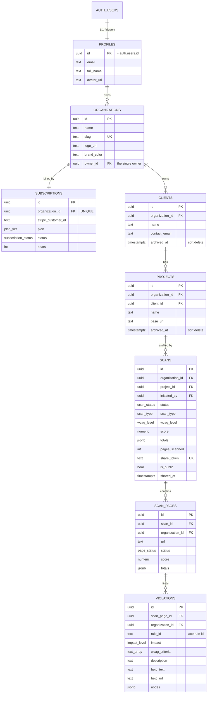

# AccessAudit Pro — Entity-Relationship Documentation

**Version:** 2.0 (MVP) · **Date:** 2026-06-13
**Database:** PostgreSQL 15 (Supabase) · **Tenant root:** `organizations` · **Tenant key:** `organization_id`

This document describes the data model implemented by the migrations in
`supabase/migrations/`. It is the authoritative reference for the schema, the
relationships, the enum types, and the RLS model.

> **MVP scope.** Per [`DB_REVIEW.md`](./DB_REVIEW.md) (decision **A**, 2026-06-13)
> the schema is the lean **8-table MVP** built on a **single-owner** model:
> one user owns one workspace via `organizations.owner_id`. Teams/RBAC,
> `invitations`, `usage_counters`, `activity_log`, the `reports` table, the
> `wcag_rules` reference table, and screenshots are **postponed** and reintroduced
> as additive migrations when their feature is scheduled (DB_REVIEW Part 3). The
> 14-table design in [`PRD.md` §6](./PRD.md) remains the production north-star.

---

## 1. ER diagram

---

## 2. Tables (summary)

| Table | Purpose | Tenant-scoped | Written by |
|---|---|---|---|
| `profiles` | App user, 1:1 with `auth.users` | no (per-user) | trigger on signup; user (self) |
| `organizations` | Agency workspace / tenant root | self (`owner_id`) | user (owner) |
| `clients` | Agency's customers | yes | owner |
| `projects` | A client's website | yes | owner |
| `scans` | One audit run (+ public share link) | yes | owner (create/share); **worker** (status/results) |
| `scan_pages` | Per-URL results | yes (denormalized) | **worker** |
| `violations` | Individual findings (denormalized axe output) | yes (denormalized) | **worker** |
| `subscriptions` | Stripe state (1 per org) | yes | **Stripe webhook** |

> "owner" = the org's `owner_id`; "worker"/"webhook" = `service_role` (bypasses RLS).

**Postponed tables** (reintroduce on demand — DB_REVIEW Part 3): `organization_members`,
`invitations`, `usage_counters`, `wcag_rules`, `reports`, `activity_log`, `screenshots`.

---

## 3. Relationships & cascade behavior

- `auth.users (1) → (1) profiles` — created by `handle_new_user()`; `ON DELETE CASCADE`.
- `profiles (1) → (N) organizations` via `owner_id` — `ON DELETE CASCADE`. Deleting the
  owner's account removes their workspace and everything under it.
- `organizations (1) → (N) clients / scans` and `(1) → (1) subscriptions` — all `ON DELETE CASCADE`.
  **Deleting an organization removes all its data.**
- `clients (1) → (N) projects` — `ON DELETE CASCADE`.
- `projects (1) → (N) scans` — `ON DELETE CASCADE`.
- `scans (1) → (N) scan_pages (1) → (N) violations` — `ON DELETE CASCADE` down the chain.
- `initiated_by → profiles` uses `ON DELETE SET NULL` so scan history survives a user deletion.

### Soft delete protects history
`clients` and `projects` carry `archived_at`. The app should **archive** (set
`archived_at`) instead of hard-deleting, so a compliance product never `CASCADE`s
away the scan/violation record that proves what was checked and when. Hard delete
remains possible (owner-only) but is reserved for genuine erasure requests.

### Denormalized `organization_id`
`scan_pages` and `violations` carry `organization_id` even though it is derivable
through `scans`. This is deliberate: RLS policies check `owns_org(organization_id)`
directly without a multi-table join on every row read, which keeps filtering fast.

### Denormalized axe output (no `wcag_rules` join)
`violations` stores `rule_id`, `impact`, `wcag_criteria`, `description`, `help_text`,
and `help_url` straight from axe-core. axe already returns this per finding, so the
MVP needs no reference table. The hand-curated plain-language *fix guidance* (the
`wcag_rules` table) is preserved in `supabase/reference/wcag_rules_seed.sql` and
reintroduced as an enrichment join in production.

---

## 4. Enum types

| Enum | Values |
|---|---|
| `scan_status` | `queued`, `running`, `completed`, `failed`, `partial` |
| `scan_type` | `single`, `list` |
| `wcag_level` | `A`, `AA`, `AAA` |
| `page_status` | `ok`, `error` |
| `impact_level` | `critical`, `serious`, `moderate`, `minor` |
| `plan_tier` | `free`, `starter`, `agency`, `scale` |
| `subscription_status` | `trialing`, `active`, `past_due`, `canceled`, `incomplete` |

> **Dropped vs v1.0** (return with their features): `member_role`,
> `invitation_status` (teams), `violation_status` (triage), `report_type` (reports table).
> `scan_type` also drops `crawl` (no auto-crawl in MVP).

---

## 5. JSONB shapes (conventions)

- `scans.totals`, `scan_pages.totals`:
  `{ "critical": int, "serious": int, "moderate": int, "minor": int }`
- `scans.target_urls`: `["https://…", "https://…"]`
- `violations.nodes`:
  `[{ "target": [cssSelector], "html": string, "failureSummary": string }]`
  — the worker should **cap node count per violation** to avoid JSONB bloat on
  pathological pages.

---

## 6. Security model (RLS)

RLS is **enabled on every table**. Access is single-owner: a user can touch org
data **iff they own the org**.

- `organizations` policies use the row's own `owner_id = auth.uid()`.
- All child tables use the helper `owns_org(org_id)` → boolean (SECURITY DEFINER,
  so it reads `organizations` while bypassing RLS — no recursion).

**Policy summary**

| Operation | Allowed |
|---|---|
| Read / write `organizations`, `clients`, `projects`, `scans` | the org **owner** |
| Read `scan_pages`, `violations`, `subscriptions` | the org **owner** |
| Write `scan_pages`, `violations` | **`service_role`** only (worker) — no client policy |
| Write `subscriptions` | **`service_role`** only (Stripe webhook) — no client policy |
| `profiles` | each user reads/writes only their own row |

There are **no role tiers** in the MVP — the owner does everything. Role-based
access (`viewer`/`member`/`admin`) returns with the teams migration.

**Privileged paths**
- The **scan worker** and **Stripe webhook** use the `service_role` key
  (server-side only) and bypass RLS to write results / billing state. The worker
  must derive `organization_id` from the dequeued scan row and never trust input.
- **Public report links** are resolved by an Edge Function that validates
  `scans.share_token` (and `is_public` / any expiry) server-side and returns
  sanitized data — `anon` has no direct table access.

---

## 7. Triggers & functions

| Object | Type | Effect |
|---|---|---|
| `handle_new_user()` | trigger on `auth.users` insert | inserts matching `profiles` row |
| `handle_new_organization()` | trigger on `organizations` insert | creates the `free` `subscriptions` row |
| `set_updated_at()` | trigger on update | maintains `updated_at` on mutable tables |
| `owns_org(org_id)` | SECURITY DEFINER fn | the single RLS predicate (ownership check) |

> **Usage / limit enforcement is app-side in the MVP:** plan limits live in an app
> constants module; usage is computed with
> `COUNT(*) FROM scans WHERE organization_id = ? AND created_at >= date_trunc('month', now())`.
> No counter table, no drift. A `usage_counters` table + increment trigger + a
> `can_run_scan()` gate return in production.

---

## 8. Migration files

| Order | File | Contents |
|---|---|---|
| 0001 | `20260613090000_initial_schema.sql` | extensions, 7 enums, 8 tables, constraints, indexes |
| 0002 | `20260613090100_functions_and_triggers.sql` | `set_updated_at`, `handle_new_user`, `handle_new_organization`, `owns_org` |
| 0003 | `20260613090200_rls_policies.sql` | enable RLS + owner policies + grants |
| dev | `../seed.sql` | local-only demo agency + sample scan |
| ref | `../reference/wcag_rules_seed.sql` | **archived** curated WCAG fix guidance (not applied; for production reintroduction) |
